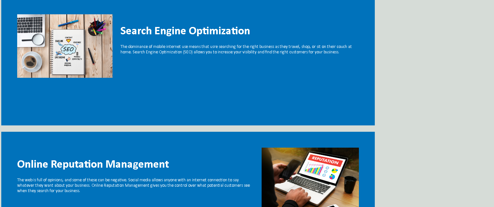

# Module 1 README

This README provides an overview of my assignment and includes relevant links and screenshots.

## Repository

The source code for this assignment is hosted on GitHub. You can access it at:

[Repository Link](https://github.com/hyperlitz/HORIZON)

## Live URL

A live version of the assignment can be viewed at:

[Live URL](https://hyperlitz.github.io/HORIZON)

## Screenshots

Include screenshots of your assignment to showcase its appearance.

## Description

In this assignment, I have implemented a sample css and html.